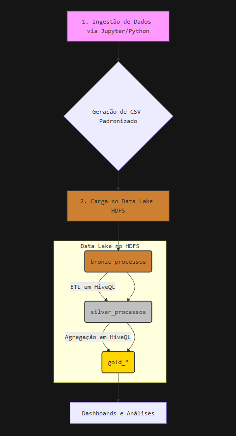

# Projeto de Pipeline de Dados com HDFS/Hive - Processos Jurídicos


-brightgreen)


## 📜 Visão Geral

Este projeto demonstra um pipeline completo de processamento de dados em batch, simulando o tratamento de um grande volume de dados processuais. O fluxo de trabalho engloba desde a ingestão de dados brutos até a criação de tabelas analíticas agregadas, prontas para consumo por ferramentas de Business Intelligence ou análise de dados.

A arquitetura utilizada é a **Medallion Architecture**, que organiza os dados em três camadas lógicas: **Bronze** (bruto), **Silver** (limpo e transformado) e **Gold** (agregado e pronto para negócio).

---

## 🏗️ Arquitetura do Pipeline

O fluxo de dados foi desenhado para garantir rastreabilidade, qualidade e performance, seguindo as etapas abaixo:




1.  **Ingestão (Python/Jupyter)**: O notebook `Ingestao.ipynb` realiza o pré-processamento inicial, tratando inconsistências e gerando um arquivo CSV limpo.
2.  **Carregamento no HDFS**: O CSV é transferido para o HDFS, servindo como fonte para a primeira camada do Data Lake.
3.  **Camada Bronze**: Os dados são armazenados em seu formato bruto, como uma cópia fiel da origem, garantindo um ponto de recuperação.
4.  **Camada Silver**: Os dados são limpos, transformados, enriquecidos e particionados para otimizar consultas futuras.
5.  **Camada Gold**: Os dados da camada Silver são agregados para criar modelos de dados específicos para as necessidades de negócio, como KPIs e métricas de performance.

---

## 🛠️ Tecnologias Utilizadas

*   **Ingestão e Pré-processamento**: Python 3.12, Pandas, Jupyter Notebook
*   **Armazenamento Distribuído**: HDFS (Hadoop Distributed File System)
*   **Data Warehousing e ETL**: Apache Hive (HiveQL)
*   **Formato de Armazenamento**: Parquet (para camadas Silver e Gold)

---

## 🚀 Como Executar

### Pré-requisitos
⚠️ Atenção: Pré-requisito Obrigatório
*   A execução deste projeto requer o ambiente Docker do repositório [**bigdata_docker**](https://github.com/fabiogjardim/bigdata_docker)
. Por favor, realize a instalação e garanta que ele esteja em plena execução antes de continuar.

### Passo a Passo

1.  **Clone o repositório**:
    ```bash
    git clone https://github.com/alexandre-s-costa/pipeline_processamento_massivo.git
    cd pipeline_processamento_massivo
    ```

2.  **Execute a Ingestão**:
    Abra e execute o notebook `Notebooks/Ingestao.ipynb` para gerar o arquivo `processos_bronze.csv` no diretório `/user/admin/datasets/cnj/bronze/`.

3.  **Carregue os dados no HDFS**:
    Crie o diretório no HDFS e copie o arquivo CSV para a camada Bronze.
    ```bash
    hdfs dfs -mkdir -p /user/admin/datasets/cnj/bronze
    hdfs dfs -put /tmp/datamart-2024.xlsx /user/admin/datasets/cnj/bronze
    ```
4.  **Execute os Scripts no Hue**:
    Execute os scripts HQL na ordem correta para criar e popular as tabelas.
    
---

## 🧬 Detalhes do Data Lake (Medallion Architecture)

### 🥉 Camada Bronze: `bronze_processos`
- **Função**: Armazenar os dados brutos ingeridos do CSV, servindo como *landing zone*.
- **Formato**: Tabela externa apontando para o arquivo CSV no HDFS.

<details>
<summary>Clique para ver o script HQL de criação</summary>

```sql
DROP TABLE IF EXISTS bronze_processos;

CREATE EXTERNAL TABLE bronze_processos (
  procedimento STRING,
  dt_baixa DATE,
  orgao_julgador STRING,
  sigla_grau STRING,
  dt_recebimento DATE,
  processoGeral STRING,
  classe STRING,
  id_classe STRING,
  dt_pendente_liquido STRING
)
ROW FORMAT DELIMITED
FIELDS TERMINATED BY ','
LOCATION '/datalake/bronze/processos/'
TBLPROPERTIES ("skip.header.line.count"="1");
```

</details>

### 🥈 Camada Silver: `silver_processos`
- **Função**: Estruturar, limpar e enriquecer os dados. Nesta etapa, normalizamos datas, limpamos campos de texto e "explodimos" registros de pendências para análise individual. A tabela é particionada por ano e mês para otimizar a performance das consultas.
- **Formato**: Tabela gerenciada, armazenada em Parquet e particionada.

<details>
<summary>Clique para ver o script HQL de ETL</summary>

```sql
-- Criação da tabela (se não existir)
CREATE TABLE IF NOT EXISTS silver_processos (
    procedimento            STRING,
    dt_baixa                DATE,
    orgao_julgador          STRING,
    sigla_grau              STRING,
    dt_recebimento          DATE,
    processoGeral           STRING,
    classe                  STRING,
    id_classe               STRING,
    dt_pendente_inicio      DATE,
    dt_pendente_fim         DATE
)
PARTITIONED BY (ano INT, mes INT)
STORED AS PARQUET;

-- Inserção dinâmica com transformação
SET hive.exec.dynamic.partition.mode=nonstrict;

INSERT INTO TABLE silver_processos PARTITION (ano, mes)
WITH cleaned AS (
    SELECT
        trim(regexp_replace(procedimento, '"', '')) AS procedimento,
        nullif(regexp_replace(dt_baixa, '"', ''), 'NULL') AS dt_baixa,
        trim(regexp_replace(orgao_julgador, '"', '')) AS orgao_julgador,
        trim(regexp_replace(sigla_grau, '"', '')) AS sigla_grau,
        nullif(regexp_replace(dt_recebimento, '"', ''), 'NULL') AS dt_recebimento,
        regexp_replace(regexp_replace(processoGeral, '"', ''), '[^0-9A-Za-z]', '') AS processoGeral,
        trim(regexp_replace(classe, '"', '')) AS classe,
        regexp_replace(regexp_replace(id_classe, '"', ''), '[{}]', '') AS id_classe,
        regexp_replace(regexp_replace(dt_pendente_liquido, '"', ''), '[{}]', '') AS dt_pendente_liquido
    FROM bronze_processos
),
exploded AS (
    SELECT
        c.*,
        pair
    FROM cleaned c
    LATERAL VIEW EXPLODE(split(c.dt_pendente_liquido, ',')) t AS pair
),
final AS (
    SELECT
        procedimento,
        CAST(dt_baixa AS DATE) AS dt_baixa,
        orgao_julgador,
        sigla_grau,
        CAST(dt_recebimento AS DATE) AS dt_recebimento,
        processoGeral,
        classe,
        id_classe,
        -- Converte a data de yyyyMMdd para o formato de data padrão
        to_date(from_unixtime(unix_timestamp(split(pair, ':')[0], 'yyyyMMdd'))) AS dt_pendente_inicio,
        to_date(from_unixtime(unix_timestamp(split(pair, ':')[1], 'yyyyMMdd'))) AS dt_pendente_fim
    FROM exploded
    WHERE split(pair, ':')[0] IS NOT NULL AND split(pair, ':')[1] IS NOT NULL -- Garante que o par de datas é válido
)
SELECT
    *,
    YEAR(dt_pendente_inicio) AS ano,
    MONTH(dt_pendente_inicio) AS mes
FROM final
WHERE dt_pendente_inicio IS NOT NULL;
```
</details>

### 🥇 Camada Gold: Tabelas Analíticas
- **Função**: Criar agregações e visões de negócio para consumo final. São tabelas menores, altamente otimizadas e que respondem a perguntas de negócio específicas.
- **Formato**: Tabelas gerenciadas, armazenadas em Parquet.

#### `gold_tempo_por_orgao`
Calcula o tempo médio de baixa e de pendência por órgão julgador, mês e ano.

<details>
<summary>Clique para ver o script HQL</summary>

```sql
CREATE TABLE IF NOT EXISTS gold_tempo_por_orgao (
    orgao_julgador STRING,
    ano INT,
    mes INT,
    tempo_medio_baixa_dias INT,
    tempo_medio_pendencia_dias INT,
    total_processos INT
) STORED AS PARQUET;

INSERT OVERWRITE TABLE gold_tempo_por_orgao
SELECT
    orgao_julgador,
    ano,
    mes,
    AVG(datediff(dt_baixa, dt_recebimento)) AS tempo_medio_baixa_dias,
    AVG(datediff(dt_pendente_fim, dt_pendente_inicio)) AS tempo_medio_pendencia_dias,
    COUNT(*) AS total_processos
FROM silver_processos
WHERE ano IS NOT NULL AND mes IS NOT NULL
GROUP BY orgao_julgador, ano, mes;
```
</details>

#### `gold_classes_tempo_pendente`
Identifica as classes processuais com maior tempo médio e máximo de pendência.

<details>
<summary>Clique para ver o script HQL</summary>

```sql
CREATE TABLE IF NOT EXISTS gold_classes_tempo_pendente (
    classe STRING,
    ano INT,
    mes INT,
    tempo_medio_pendente_dias INT,
    tempo_maximo_pendente_dias INT,
    total_processos INT
) STORED AS PARQUET;

INSERT OVERWRITE TABLE gold_classes_tempo_pendente
SELECT
    classe,
    ano,
    mes,
    AVG(datediff(dt_pendente_fim, dt_pendente_inicio)) AS tempo_medio_pendente_dias,
    MAX(datediff(dt_pendente_fim, dt_pendente_inicio)) AS tempo_maximo_pendente_dias,
    COUNT(*) AS total_processos
FROM silver_processos
WHERE dt_pendente_inicio IS NOT NULL AND dt_pendente_fim IS NOT NULL
GROUP BY classe, ano, mes;
```
</details>

#### `gold_orgao_tempo_pendente`
Identifica os órgãos julgadores com maior tempo médio e máximo de pendência.

<details>
<summary>Clique para ver o script HQL</summary>

```sql
CREATE TABLE IF NOT EXISTS gold_orgao_tempo_pendente (
    orgao_julgador STRING,
    ano INT,
    mes INT,
    tempo_medio_pendente_dias INT,
    tempo_maximo_pendente_dias INT,
    total_processos INT
) STORED AS PARQUET;

INSERT OVERWRITE TABLE gold_orgao_tempo_pendente
SELECT
    orgao_julgador,
    ano,
    mes,
    AVG(datediff(dt_pendente_fim, dt_pendente_inicio)) AS tempo_medio_pendente_dias,
    MAX(datediff(dt_pendente_fim, dt_pendente_inicio)) AS tempo_maximo_pendente_dias,
    COUNT(*) AS total_processos
FROM silver_processos
WHERE dt_pendente_inicio IS NOT NULL AND dt_pendente_fim IS NOT NULL
GROUP BY orgao_julgador, ano, mes;